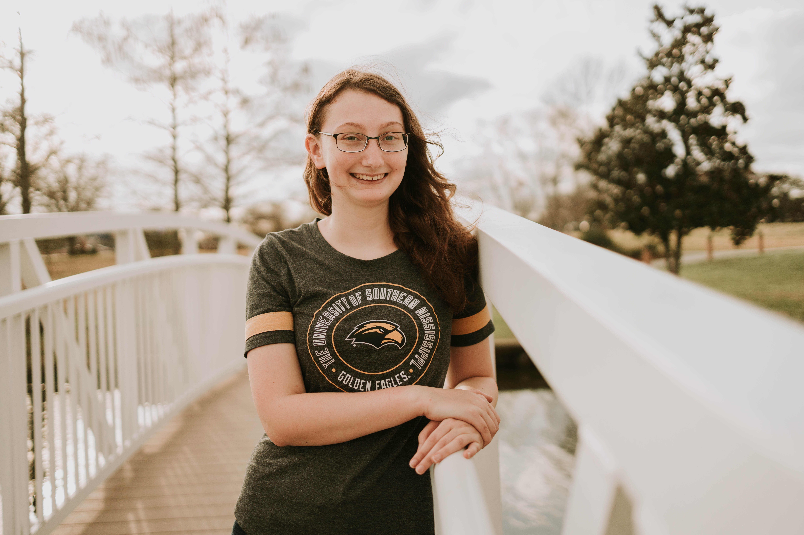

```{r, echo=F, warning=F, message=F}
if (!require("pacman")) install.packages("pacman")
pacman::p_load(knitr)
```
<h2 style="text-align: center;" markdown="10">

Alycia Johnson

</h2> 

###

```{r, echo=FALSE, fig.cap="Photo by Eisley & Oak Photography", out.width = '50%', fig.align='center'}

```
   
<h4 style="text-align: center;">

Email: ajohn154\@ur.rochester.edu

</h4>     

Being a military child, I was born in Japan and have lived all over the world. I received my B.S. in Biology specializing in Conservation Biology from the University of Southern Mississippi. While there, I worked in Dr. Kaitlin Baudier’s lab focusing on the natural history and thermal physiology of Mischocyttarus phthisicus in Puerto Rico. I also worked on the thermal physiology of Mischocyttarus mexicanus in New Orleans, LA.

I came to the University of Rochester in the Fall of 2023. I am generally interested in plasticity, local thermal adaptations, and social evolution. My research will focus on local climatic adaptations in the Mischocyttarus mexicanus genome across a large climatic gradient in southeastern USA. This will consist of identifying the genes undergoing thermal selection, modeling the demographic history of these populations to model future range expansions, and linking genetic signatures of selection to behavioral and morphological traits. Overall, I hope to bridge the gap between lab-based genetics and genomics with field-based ecology and make science accessible to the general public.


----------------------------------

 > ## Publications

<script type='text/javascript' src='https://d1bxh8uas1mnw7.cloudfront.net/assets/embed.js'></script>

##

<!-- 1. _**Das, B.**, Brouns, R., Will, I., Brachmann, A., de Bekker, C. (2023)_ Using RNASeq to investigate the involvement of the _Ophiocordyceps_ clock in ant host infection and behavioral manipulation. _bioRxiv_ [*PDF*](https://www.biorxiv.org/content/10.1101/2023.01.20.524843v2.abstract) -->
<!-- <div class='altmetric-embed' data-badge-popover="right" data-badge-type='donut' data-doi="10.1101/2023.01.20.524843"></div> -->

3. _**Johnson, A. N.**, Cook, H., Reeve, H. K., & Uy, F. M. K._ (in prep). Grouping with non-kin: when potential joiners and residents should be mutually accepting. 

-----

2. _Robinson, K. M., Mabry, Z. C., Schonekas, H., Robles López, K. Y., **Johnson, A. N.**, Cipriani, G., Nguyen, A., Ziemke, C. H., Baudier, K. M._ (submitted). Is disturbance stridulation in the passalid beetle Odontotaenius disjunctus a form of social communication? _Insectes Sociaux_.

-----

1. _**Johnson, A.**, Ziemke, C. H., Yee, D. A., & Baudier, K. M. (2024)._ Notes on the natural history and climatic specializations of an endemic Caribbean paper wasp (Hymenoptera: Vespidae: _Mischocyttarus phthisicus_). _Caribbean Naturalist. 96, 1-8._ [PDF](./Papers/Johnson et. al, 2024.pdf )
