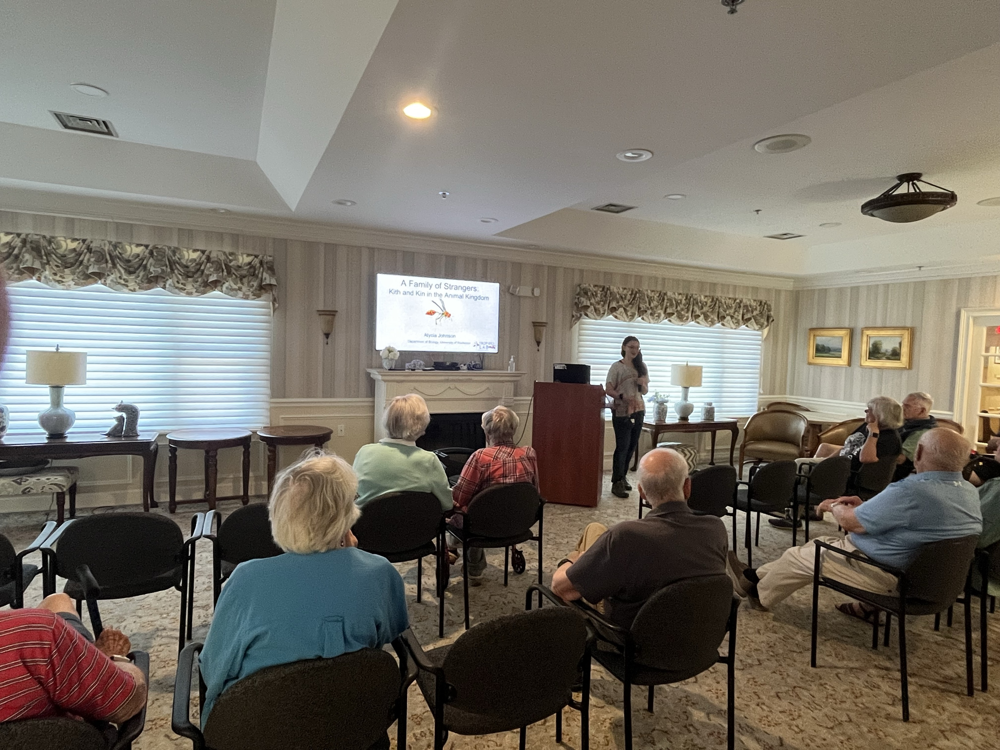

```{r setup, include=FALSE}

if (!require("pacman")) install.packages("pacman")
pacman::p_load(knitr)

knitr::opts_chunk$set(echo = F)
knitr::opts_chunk$set(warning = F)
knitr::opts_chunk$set(message = F)
```


<style>
body {text-align: left}
</style>

___
## TA Courses

BIOL 267: Human Evolutionary Genetics (2024-2025)

  - This course looks at human evolution through the eyes of population genetics and genomics. Topics include the origin of humans, demographic history of human populations, archaic human species, evolution of the human genome, molecular and phenotypic evolution, cultural evolution, and genetic diseases. 

___

## Undergraduate Mentees

1. Aditi Jasapara, 2024-current
   - Summer Research Grant

2. Aidan Craner, 2024-current
   - Summer Research Grant
 
___

## Outreach Activities

Highlands at Pittsford Retirement Community

 - Invited Guest Speaker, 2024
```{r, out.width = '50%', fig.align='center'}

```

