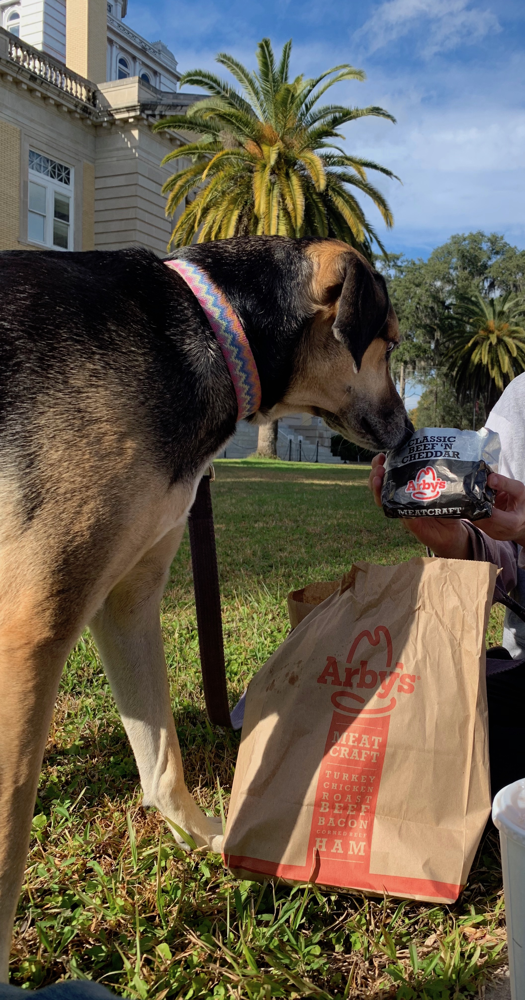

```{r setup, include=FALSE}

if (!require("pacman")) install.packages("pacman")
pacman::p_load(knitr)

knitr::opts_chunk$set(echo = F)
knitr::opts_chunk$set(warning = F)
knitr::opts_chunk$set(message = F)
```


<style>
body {text-align: left}
</style>

___

## 1. Relatedness and Grouping Strategies

Insert abstract about relatedness project here 

```{r, fig.cap="Me and Arbys.", out.width = '50%', fig.align='center'}
#
```
   
___

## 2. Long Term Responses to Climate Change

<div style="display: flex; align-items: center;">
  <p style="width: 50%;">
  Changing climates, whether long-term or short-term, have elicited adaptive responses in the populations experiencing those changes. Whole genome scans for signatures of selection reveal how adaptations arise, their underlying genetic basis. We take advantage of the Mexican Paper Wasp Mischocyttarus mexicanus, widely distributed ranges from southern Florida to North Carolina and Texas, adapting to different climates. Our previous work showed two distinct genetic clusters that divide subtropical populations (South) and temperate populations (North). Here, we implement genome-wide selection scan techniques to identify genes under selection in different populations and investigate the genetic basis of local adaptation. Population genetic statistics support the hypothesis of a northward range expansion and genetic structure between temperate and subtropical populations. Selection scans reveal genomic regions associated with mitochondrial metabolism highlight possible adaptations that allow a northward range expansion. We will further explore adaptations that facilitate range expansions while accounting for demographic history.
  </p>
  
</div>

___

## 3. Demographic History of a Subtropical Wasp

Insert abstract about Demographic modelling here

___

## 4. Past Projects

* Natural History of a Caribbean paper wasp