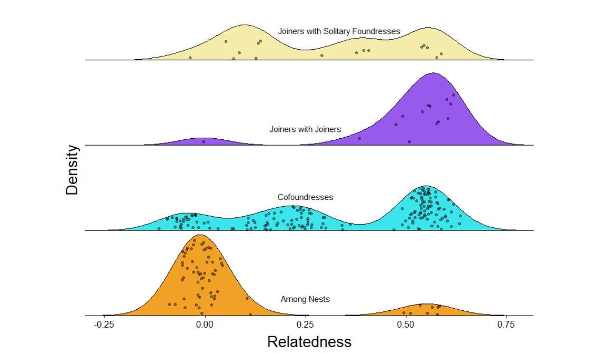
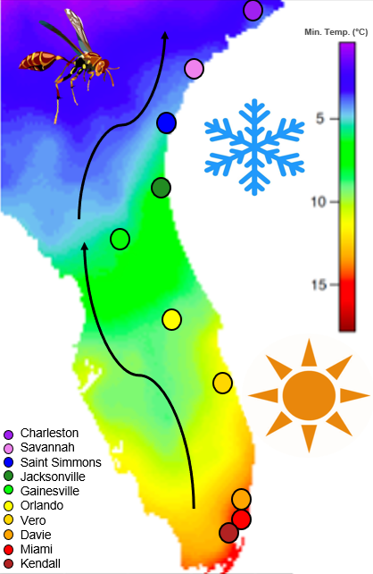
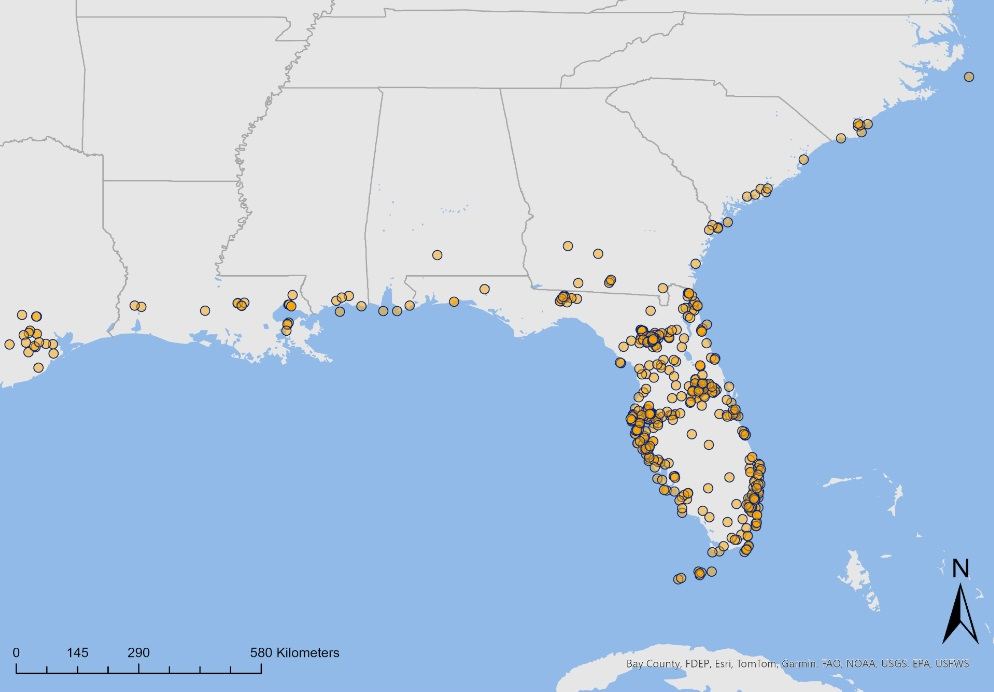

```{r setup, include=FALSE}

if (!require("pacman")) install.packages("pacman")
pacman::p_load(knitr)

knitr::opts_chunk$set(echo = F)
knitr::opts_chunk$set(warning = F)
knitr::opts_chunk$set(message = F)
```


<style>
body {text-align: left}
</style>

___

## 1. Relatedness and Grouping Strategies

The evolution of cooperation among related individuals has been a subject of much study in biology. Hamilton's rule states that altruistic behavior should occur when the benefits to the giver outweigh the costs. This normally applies to related individuals, but what causes the evolution of cooperation between unrelated individuals? Many theoretical models have been proposed and tested in social insects, including the transactional model and the tug-of-war model. In the subtropical end of our paper wasps' range, unrelated individuals often group together during the founding stages of nest development. This stage is often fluid with group membership changing often before final colony membership is decided. Preliminary work shows cooperation between unrelated nestmates might be due to the numerous ecological constraints present. Towards the temperate end of their range, it is hypothesized that group formation is dictated by seasonality. We hope to explore different grouping behaviors in various parts of their range using lab colonies of wasps, originating from across their range, exposed to different temperature regimes.

```{r, fig.cap="Group relatedness among wasps in the subtropical range.", out.width = '80%', fig.align='center'}

```
   
___

## 2. Long Term Responses to Climate Change

<div style="display: flex; align-items: center;">
  <p style="width: 50%;">
  Changing climates, whether long-term or short-term, have elicited adaptive responses in the populations experiencing those changes. Whole genome scans for signatures of selection reveal how adaptations arise, their underlying genetic basis. We take advantage of the Mexican Paper Wasp Mischocyttarus mexicanus, widely distributed ranges from southern Florida to North Carolina and Texas, adapting to different climates. Our previous work showed two distinct genetic clusters that divide subtropical populations (South) and temperate populations (North). Here, we implement genome-wide selection scan techniques to identify genes under selection in different populations and investigate the genetic basis of local adaptation. Population genetic statistics support the hypothesis of a northward range expansion and genetic structure between temperate and subtropical populations. Selection scans reveal genomic regions associated with mitochondrial metabolism highlight possible adaptations that allow a northward range expansion. We will further explore adaptations that facilitate range expansions while accounting for demographic history.
  </p>
  
</div>

___

## 3. Demographic History of a Subtropical Wasp

**THIS CANT JUST BE YOUR GRFP STATEMENT
To uncover the effects of climate change in the evolutionary history of this social wasp, I propose to identify the pressures that shaped populations across the climatic transect. My preliminary analysis shows decreasing genetic diversity (π) as the climate becomes cooler, which is consistent with our understanding of this species expanding northward out of subtropical Florida. I will use demographic modeling to directly test the hypothesis of expansion into a new climatic region, including inferring effective population size through time, founder events linked to range expansions, and bottleneck events. I hypothesize a range expansion out of the subtropics that started at the end of the last glacial maximum in North America, facilitating this species to expand to temperate zones. I will collect samples for whole-genome sequencing from the southernmost point of the Florida Keys in addition to pilot data to compare populations that respond to tropical, subtropical, and temperate selective pressures. I will estimate effective population sizes through time and to test the model of range expansion using PopSizeABC and Fastsimcoal2.

```{r, out.width = '70%', fig.align='center'}

```

___

## 4. Past Projects

* Natural History of a Caribbean paper wasp
* Thermal Ecology of Ants in the Luquillo Mountains
* Wing Asymmetries and Handedness in Aphid Lines