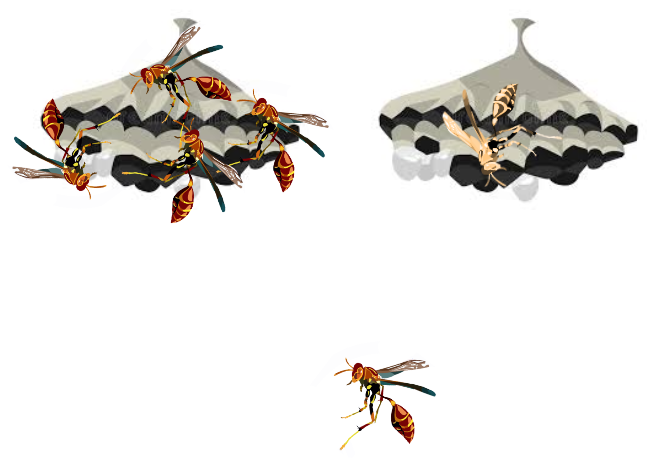

```{r setup, include=FALSE}

if (!require("pacman")) install.packages("pacman")
pacman::p_load(knitr)

knitr::opts_chunk$set(echo = F)
knitr::opts_chunk$set(warning = F)
knitr::opts_chunk$set(message = F)
```


<style>
body {text-align: left}
</style>

___

## 1. Relatedness and Kin Selection

<div style="display: flex; align-items: center;">
  <p style="width: 50%;">
  The evolution of cooperation among related individuals has been a subject of much study in biology. Hamilton's rule states that altruistic behavior should occur when the benefits to the giver outweigh the costs. This normally applies to related individuals, but what promotes the evolution of cooperation between unrelated individuals? Social insects are a classic system to explore elements of kin selection such as this one. I'm particularly interested in the conditions that promote cooperation, kin recognition, and grouping in social wasps. 
  </p>
  
</div>

___

## 2. Long Term Responses to Climate Change

<div style="display: flex; align-items: center;">
  <p style="width: 50%;">
  Changing climates, whether long-term or short-term, have elicited adaptive responses in the populations experiencing those changes. Understanding these adaptive responses on all levels allows us to have deeper knowledge of adaptation and climatic resilience. I am using whole genome selection scan techniques along with gene expression to find potential candidate genes related to climate adaptation in the social paper wasp, _Mischocyttarus mexicanus_. 
  </p>
  
</div>

___

## 3. Demographic History of a Subtropical Wasp

<div style="display: flex; align-items: center;">
  <p style="width: 100%;">
  Understanding the demographic history of a species is important when trying to understand their short and long-term evolutionary history. The social paper wasp, _M. mexicanus_, is thought to have expanded northward out of Florida after establishing in North America. I am using demographic modeling and population genetics to predict and model this historic expansion into a new climatic region, including changes in population size, founder events, and bottleneck events.
  </p>
  
</div>

___

## 4. Past Projects

* Natural History of a Caribbean paper wasp
* Thermal Ecology of Ants in the Luquillo Mountains
* Wing Asymmetries and Handedness in Aphid Lines